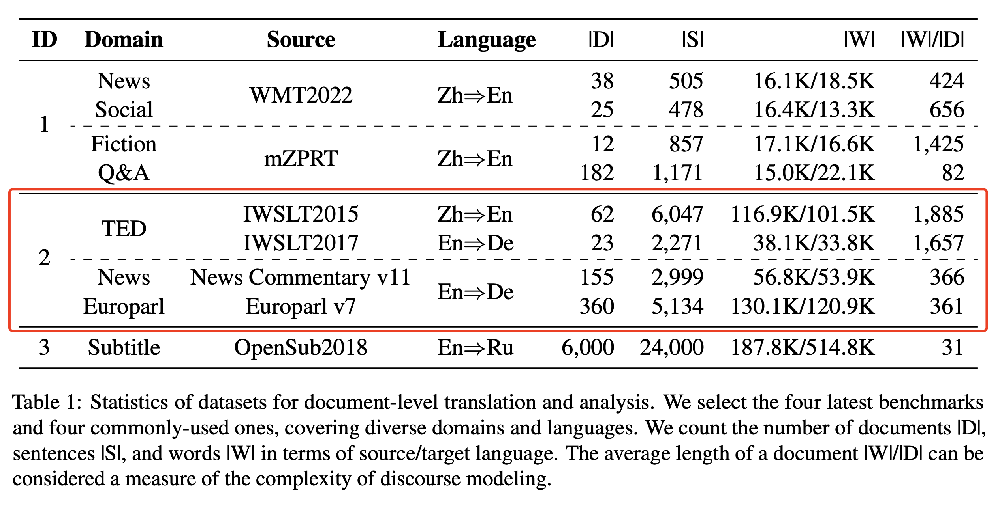
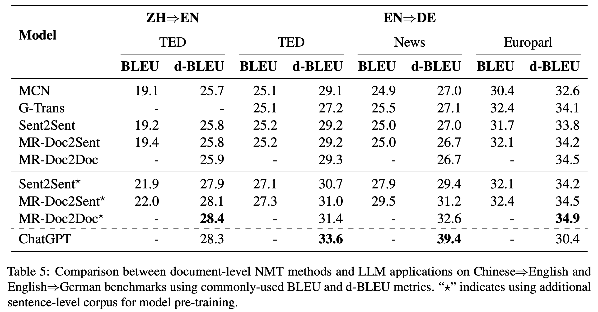

# ChatGPT vs. Document NMT Methods

Datasets and Experimental Results in [4.2 ChatGPT vs. Document NMT Methods].

### **Dataset Details** 

We use four widely used document-level translation benchmarks: TED (ZH-EN and EN-DE), News (EN-DE), and Europarl (EN-DE). 

    

Accordingly, we release all datasets, including input with prompts, translation outputs and reference. The catalog is as follows:

    .
    ├── europarl_en2de              # Europarl (EN-DE) dataset
    │   ├── test.en.doc             # Original input
    │   ├── test.de.doc             # Reference
    │   ├── test.en.doc.prompt      # Input for ChatGPT
    │   ├── chatgpt.result          # Output of ChatGPT
    │   ├── chatgpt.result.merge    # Merged translation results for document-level evaluation
    ├── news_en2de                  # News (EN-DE) dataset
    │   ├── test.en.doc             # Original input
    │   ├── test.de.doc             # Reference
    │   ├── test.en.doc.prompt      # Input for ChatGPT
    │   ├── chatgpt.result          # Output of ChatGPT
    │   ├── chatgpt.result.merge    # Merged translation results for document-level evaluation
    ├── ted_en2de                   # TED (EN-DE) dataset
    │   ├── test.en.doc             # Original input
    │   ├── test.de.doc             # Reference
    │   ├── test.en.doc.prompt      # Input for ChatGPT
    │   ├── chatgpt.result          # Output of ChatGPT
    │   ├── chatgpt.result.merge    # Merged translation results for document-level evaluation
    ├── ted_zh2en                   # TED (ZH-EN) dataset
    │   ├── test.zh.doc             # Original input
    │   ├── test.en.doc             # Reference
    │   ├── test.zh.doc.prompt      # Input for ChatGPT
    │   ├── chatgpt.result          # Output of ChatGPT
    │   ├── chatgpt.result.merge    # Merged translation results for document-level evaluation    

### **Experimental Results**

We compare ChatGPT with advanced document-level NMT methods that have achieved state-of-the-art performance on several benchmarks by utilizing various techniques to capture document-level information and discourse structure: [MCN](https://www.ijcai.org/proceedings/2020/0551.pdf), [G-Trans](https://aclanthology.org/2021.acl-long.267.pdf), Sent2Sent, MR-Doc2Sent and [MR-Doc2Doc](https://aclanthology.org/2022.findings-acl.279.pdf). We adopt tokenized case-insensitive BLEU and d-BLEU as the evaluation metrics.

    

