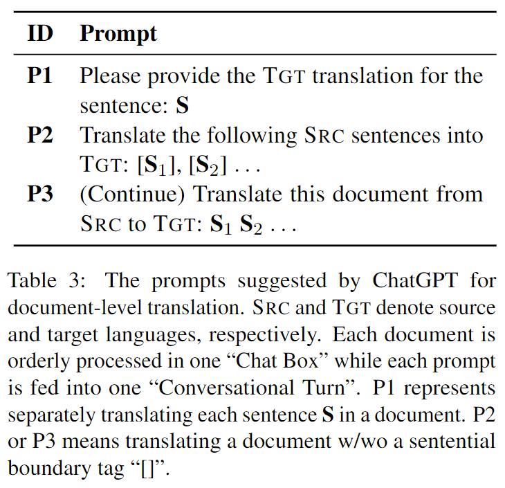
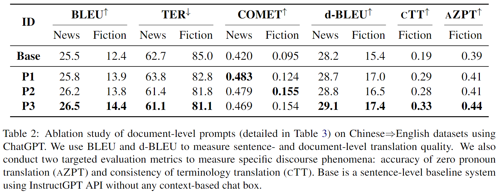

# Effects of Discourse Aware Prompts

Datasets and Experimental Results in [Effects of Discourse Aware Prompts].

### **Dataset Catalog** 

We release related datasets and translation outputs as follows.

benchmark for Zero Pronoun Recovery and Translation, this benchmark contains the zero pronoun annotations (handcraft) from five different source. 

    .
    ├── Base                       # Sentence-level baseline using InstructGPT API without any context-based chat box
    │   ├── Fiction                # mZPRT Fiction
    │   │   ├── *.format_1.zh      # Input formated into Prompt 1
    │   │   ├── *.format_1.en      # Translation output
    │   ├── News                   # WMT2022 News
    │   │   ├── *.format_1.zh      # Input formated into Prompt 1
    │   │   ├── *.format_1.en      # Translation output
    ├── P1                         # ChatGPT output via Prompt 1
    │   ├── Fiction                # mZPRT Fiction
    │   │   ├── *.format_1.zh      # Input formated into Prompt 1
    │   │   ├── *.format_1.en      # Translation output
    │   ├── News                   # WMT2022 News
    │   │   ├── *.format_1.zh      # Input formated into Prompt 1
    │   │   ├── *.format_1.en      # Translation output
    ├── P2                         # Combine multiple continuous sentences and translate them in one conversational turn until the entire document is finished with boundary tag “[]”.
    │   ├── Fiction                # mZPRT Fiction
    │   │   ├── *.format_2.zh      # Input formated into Prompt 2
    │   │   ├── *.format_2.en      # Translation output (post-processed into sentence level without boundary tag)
    │   ├── News                   # WMT2022 News
    │   │   ├── *.format_2.zh      # Input formated into Prompt 2
    │   │   ├── *.format_2.en      # Translation output (post-processed into sentence level without boundary tag)
    ├── P3                         # Combine multiple continuous sentences and translate them in one conversational turn until the entire document is finished without boundary tag “[]”.
    │   ├── Fiction                # mZPRT Fiction
    │   │   ├── *.format_3.zh      # Input formated into Prompt 3
    │   │   ├── *.format_3.en      # Translation output (post-processed into sentence level)
    │   ├── News                   # WMT2022 News
    │   │   ├── *.format_3.zh      # Input formated into Prompt 3
    │   │   ├── *.format_3.en      # Translation output (post-processed into sentence level)
    ├── Orignal_Dataset            # Sentence-level baseline using InstructGPT API without any context-based chat box
    │   ├── Fiction                # mZPRT Fiction
    │   │   ├── *.zh               # Input in orignal fomat
    │   │   ├── *.en               # Reference in orignal fomat
    │   ├── News                   # WMT2022 News
    │   │   ├── *.zh               # Input in orignal fomat
    │   │   ├── *.en1              # Reference1 in orignal fomat
    │   │   ├── *.en2              # Reference2 in orignal fomat

### **Experimental Results**

### **Contact information**

Wang, Longyue : vinnylywang@tencent.com