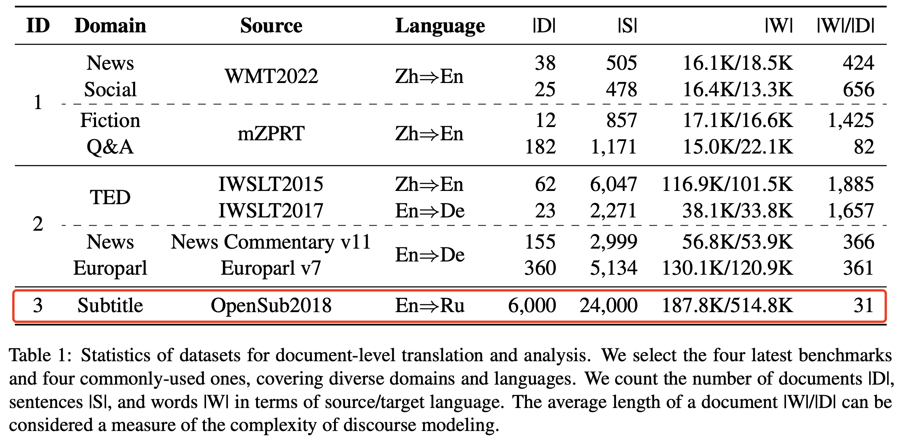

# Probing Discourse Knowledge in LLM

Datasets used in [5.1 Probing Discourse Knowledge in LLM].

### **Dataset Details** 

In order to verify whether LLMs (i.e., ChatGPT and GPT-4) truly learn to utilize the context to resolve discourse inconsistencies, we adopt the contrastive test sets proposed by [Voita](https://github.com/lena-voita/good-translation-wrong-in-context). 

    

This dataset includes deixis, lexicon consistency, ellipsis (inflection), and ellipsis (verb phrase) for evaluating discourse phenomena in English-Russian translations. We release all input datasets of ChatGPT and GPT-4, their responses and human annotation. The catalogue is as follows:

    .
    ├── chatgpt-results                  # 
    │   ├── deixis_test.src              # Input for ChatGPT
    │   ├── deixis_test.output           # Output of ChatGPT
    │   ├── deixis_test.human.src        # Sampled Input of Human evaluation
    │   ├── deixis_test.human.output     # Sampled Output of Human evaluation
    │   ├── deixis_test.human.pred.acc   # Human annotation for model's prediction (0: wrong, 1: correct)
    │   ├── deixis_test.human.expl.acc   # Human annotation for model's explanation (0: wrong, 1: correct)
    |   ├── ... 
    ├── gpt4-results               
        ├── deixis_test.src              # Input for GPT-4
        ├── deixis_test.output           # Output of GPT-4
        ├── deixis_test.human.src        # Sampled Input of Human evaluation
        ├── deixis_test.human.output     # Sampled Output of Human evaluation
        ├── deixis_test.human.pred.acc   # Human annotation for model's prediction (0: wrong, 1: correct)
        ├── deixis_test.human.expl.acc   # Human annotation for model's explanation (0: wrong, 1: correct)
        ├── ... 
